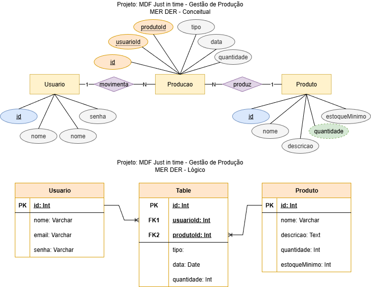

# MDF - Justi in time
MDF (Modular Development Framework) Just in time (Estoque Mínimo) é uma ferramenta desenvolvida para auxiliar na gestão de estoques de pequenas fábricas de produtos manufaturados. O objetivo principal do MDF Just in time é otimizar o processo de produção, garantindo que os materiais necessários estejam disponíveis no momento certo, evitando excessos de estoque e reduzindo custos operacionais.

## Distribuição de pastas
```
./api - Backend (Node.js, Express.js, Prisma)
./web - Frontend (HTML, CSS, JavaScript)
./docs - Documentação e diagramas
**/README.md - Documentação do projeto
```
## Instruções para executar o projeto localmente
- 1 Clone o repositório do projeto:
```bash
git clone <URL_DO_REPOSITORIO>
```
- 2 Navegue até o diretório do backend e instale as dependências:
```bash
cd api
npm install
```
- 3 Configure o banco de dados:
  - Certifique-se de que o XAMPP está instalado e em execução.
  - Abra o XAMPP Control Panel e inicie o serviço MySQL.
  - Atualize o arquivo `.env` na pasta `api` com as credenciais do banco de dados.
  ```env
  DATABASE_URL="mysql://root@localhost:3306/preparacao_db"
  ```
  - Execute as migrações do Prisma para criar as tabelas no banco de dados:
  ```bash
  npx prisma migrate dev --name init
  ```
- 4 Inicie o servidor backend:
```bash
npm run dev
## ou
npm start
```
- 5 Abra o frontend:
- Navegue até a pasta `web` e abra o arquivo `index.html` em seu navegador, ou com o Live Server do VSCode.

## Entregas:
---
### [Lista de Requisitos Funcionais](./docs/Requisitos_funcionais.md)
---
### Diagrama entidade relacionamento DER

### Script de criação e população do banco de dados
  - [Script de Criaçã - prisma/schema.prisma](./api/prisma/schema.prisma)
  - [Script de população - prisma/seed.js](./api/prisma/seed.js)
---
### Interface de autenticação de usuários (login)

---
### Interface principal do sistema

---
### Interface cadastro de produtos


---
### Interface gestão de produção (Just in time)


---
### [Descritivo de Casos de Teste de Software](./docs/casos_de_teste.md)
---
## Lista de requisitos de infraestrutura
- Ambiente de desenvolvimento:
  - Node.js (versão 14 ou superior, JavaScript)
  - Prisma ORM (versão 4.0 ou superior)
  - Express.js (versão 4.0 ou superior)
  - XAMPP (MySQL) (Server version: 10.4.32-MariaDB)
  - HTML5, CSS3, JavaScript
- Sistema Operacional:
  - Windows 10 ou superior / Linux / MacOS

## LISTA DE VERIFICAÇÃO POR ATIVIDADE
### ATIVIDADE:ATIVIDADE 1 - DOCUMENTAÇÃO DE REQUISITOS
| Evidência observável | Capacidade | Peso | Sim | Não|
|-|-|-|:-:|-|
| Desenvolveu o sistema conforme análise de requisitos? |C6|2|Sim||
| Modelou os requisitos funcionais mínimos conforme descrito |C6|2|Sim||

### ATIVIDADE:ATIVIDADE 2: DER
| Evidência observável | Capacidade | Peso | Sim | Não|
|-|-|-|:-:|-|
| Atribui às relações de chaves estrangeiras de acordo com a modelagem do diagrama entidade relacionamento (DER)?|C4|2|Sim||
|Atribui às relações entre as tabelas (ex: 1:N) no diagrama entidade relacionamento físico (DER)?|C4|2|Sim||
|Atribuiu os tipos (ex: DATE) Se utilizou o modelo **Lógico**, no modelo **Conceitual** é dispensável|C4|2|Sim||
|Modelou no mínimo as entidades **Usuário**, **Produto** e **Producao***?|C4|1|Sim||

### ATIVIDADE:ATIVIDADE 3: SCRIPT BANCO DE DADOS
| Evidência observável | Capacidade | Peso | Sim | Não|
|-|-|-|:-:|-|
|Criou o banco de dados com o nome especificado no caderno de prova?|C4|1|Sim||
|Criou todas as tabelas modeladas no diagrama entidade relacionamento respeitando a chave estrangeira (NOT NULL) de cada relacionamento?|C4|2|Sim||
|Inseriu pelo menos três registros em cada uma das tabelas criadas no banco de dados?|C4|2|Sim||

### ATIVIDADE:ATIVIDADE 4: INTERFACE AUTENT. DE USUÁRIO
| Evidência observável | Capacidade | Peso | Sim | Não|
|-|-|-|:-:|-|
|Criou uma sessão para o usuário autenticado?|C7|2|Sim||
|Desenvolveu a autenticação do usuário redirecionando-o para a interface principal da aplicação ao inserir login e senha registrado no banco de dados?|C7|3|Sim||
|Desenvolveu os campos de login,senha e botão entrar?|C7|2|Sim||
|Realizou o tratamento de falha de autenticação no login, informando o motivo da falha?|C7|3|Sim||

### ATIVIDADE:ATIVIDADE 5: INTERFACE PRINCIPAL
| Evidência observável | Capacidade | Peso | Sim | Não|
|-|-|-|:-:|-|
|Desenvolveu um meio de acessar a interface cadastro de produto?|C7|1|Sim||
|Desenvolveu um meio de acessar a interface gestão de produção (Just in time)?|C7|1|Sim||
|Desenvolveu um meio para sair do sistema, direcionando à interface de login?|C7|1|Sim||
|Recuperou e exibiu o nome do usuário autenticado?|C7|2|Sim||

### ATIVIDADE:ATIVIDADE 6: INTERFACE CADASTRO DE PRODUTO
| Evidência observável | Capacidade | Peso | Sim | Não|
|-|-|-|:-:|-|
|Desenvolveu a programação de listar os produtos cadastrados ao carregar a interface cadastro de produto?|C7|2|Sim||
|Desenvolveu a programação para a inserção de um novo produto no banco de dados?|C7|2|Sim||
|Desenvolveu a programação para editar um produto já existente no banco de dados?|C7|3|Sim||
|Desenvolveu a programação para excluir um produto já existente no banco de dados?|C7|2|Sim||
|Desenvolveu a programação para para validar os dados no cadastro e na atualização do produto?|C7|3|Sim||
|Desenvolveu um meio de o usuário retornar a interface principal?|C7|1|Sim||
|Implementou um campo de busca onde usuário insere o dado e a listagem de produtos é atualizada conforme termo inserido?|C7|3|Sim||

### ATIVIDADE:ATIVIDADE 7: INTERFACE GESTÃO DE PRODUÇÃO (JUST IN TIME)
| Evidência observável | Capacidade | Peso | Sim | Não|
|-|-|-|:-:|-|
|Desenvolveu a programação para o usuário selecionar o produto e selecionar se o produto foi pedido (entrar) ou produzido (sair) no estoque? (Atualizando o campo quantidade na tabela de produtos)|C7|2|Sim||
|Desenvolveu a programação que o usuário possa inserir data de movimentação de entrada ou saída?|C7|3|Sim||
|Desenvolveu a programação, para que a lista gerada seja em ordem alfabética?|C7|3|Sim||
|Implementou a verificação automática gerando o alerta de estoque abaixo do mínimo configurado?|C7|3|Sim||

### ATIVIDADE:ATIVIDADE 8: CASOS DE TESTES
| Evidência observável | Capacidade | Peso | Sim | Não|
|-|-|-|:-:|-|
|Descreveu ferramentas e ambiente de testes?|C8|2|||
|Descreveu os casos de testes para cada requisito funcional?|C8|2|Sim||
|Executou testes em cada requisito funcional conforme casos de teste?|C8|2|Sim||

### ATIVIDADE:ATIVIDADE 9: DOCUMENTAÇÃO DE INFRAESTRUTURA
| Evidência observável | Capacidade | Peso | Sim | Não|
|-|-|-|:-:|-|
|Identificou a linguagem de programação e a versão no desenvolvimento do sistema?|C1|1|Sim||
|Identificou o SGBD (sistema gerenciador de banco de dados?) utilizado e sua respectiva versão para a criação do banco de dados no servidor?|C1|1|Sim||
|Identificou Sistema operacional e sua versão para o desenvolvimento da aplicação?|C1|1|Sim|||