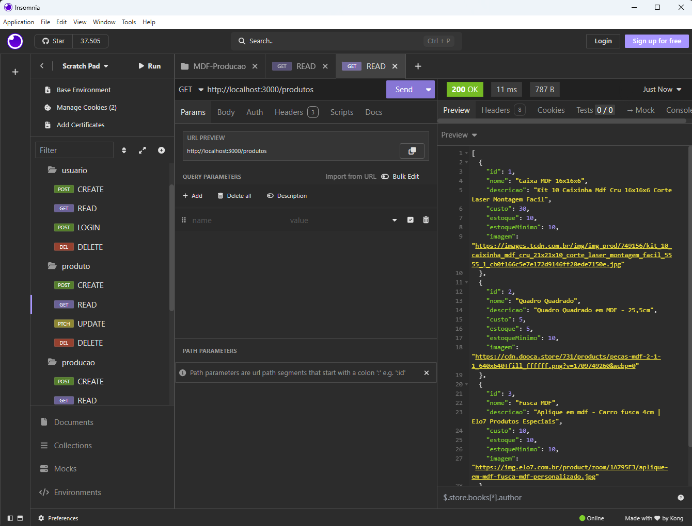
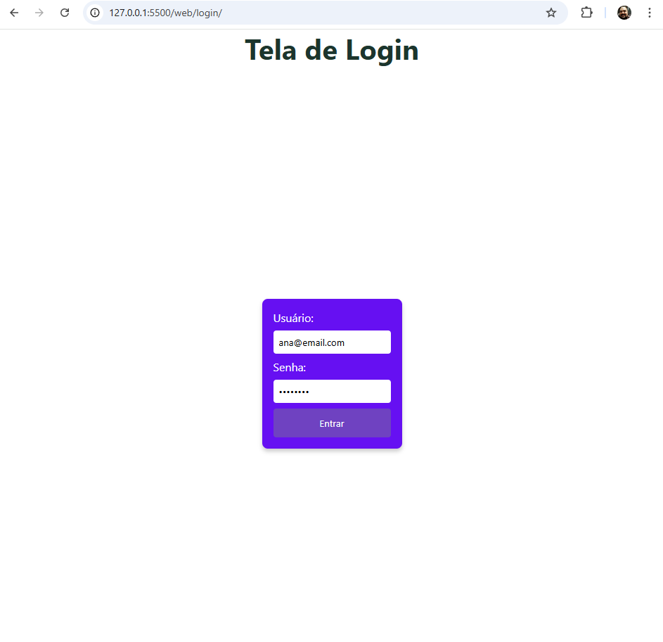
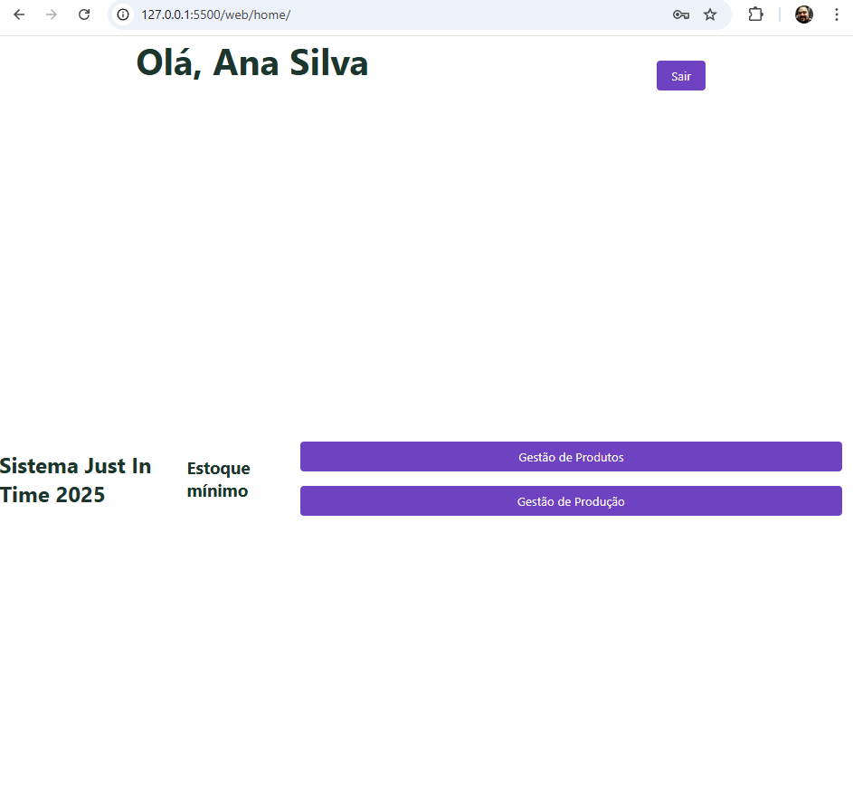
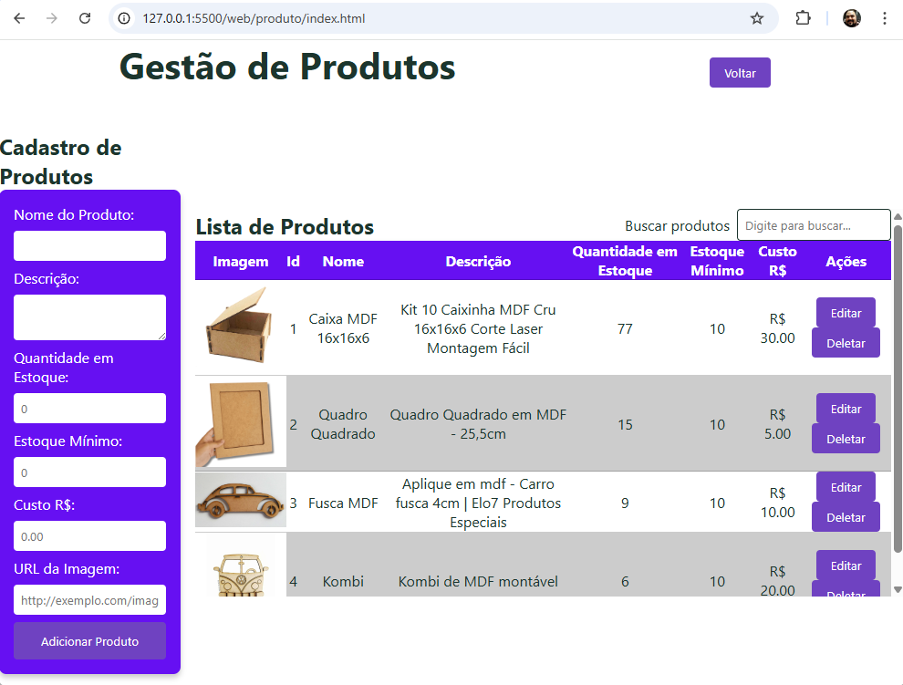
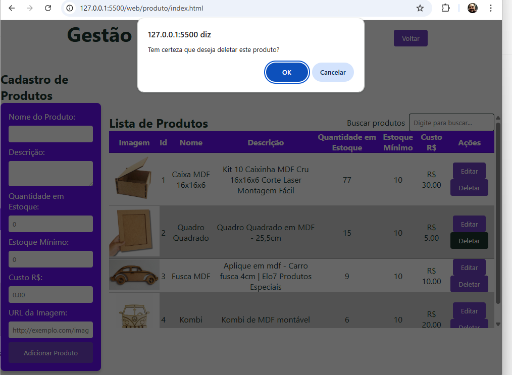
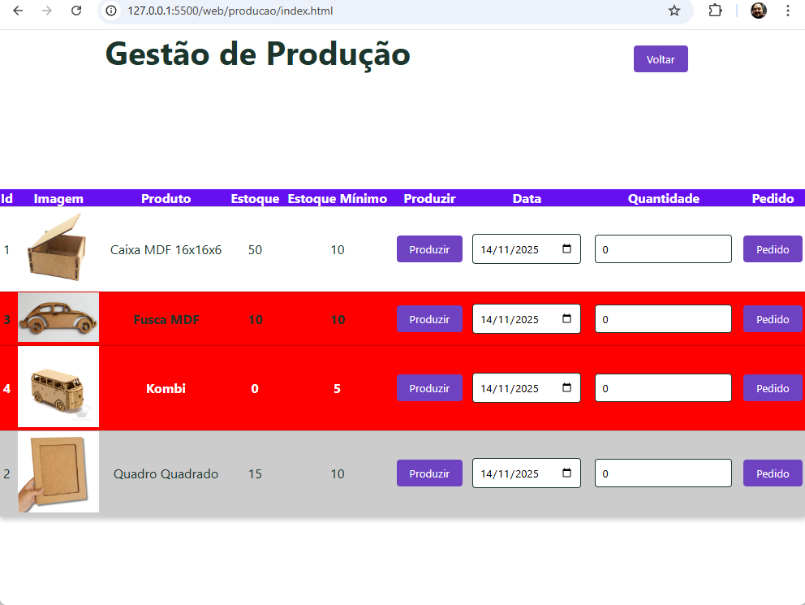
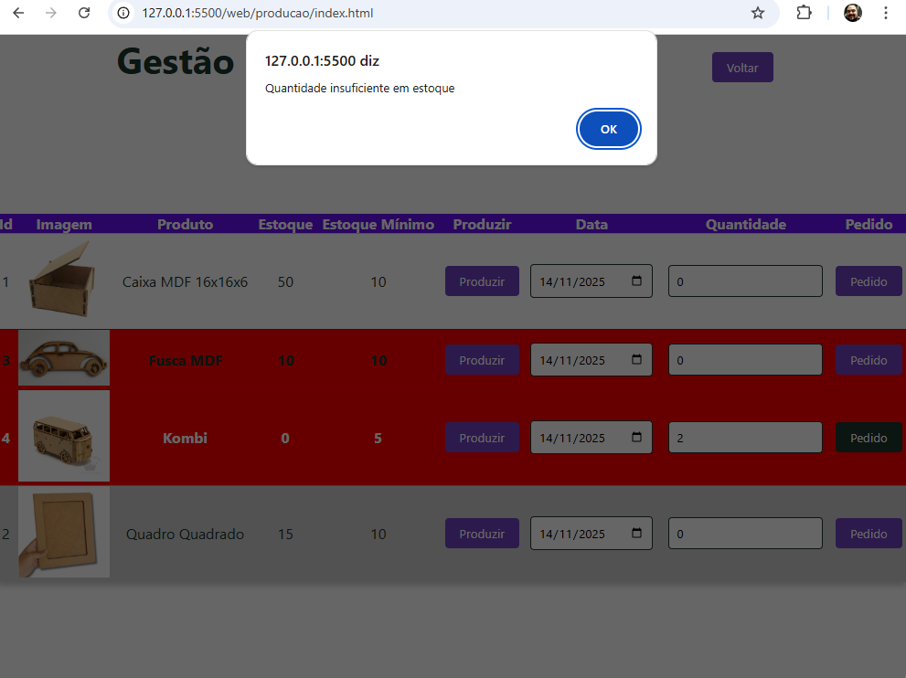

# Casos de Teste de Software
A primeira parte do sistema consiste no banco de dados e backend, que gerencia a lógica de negócios e o armazenamento de dados. A segunda parte é o frontend, que fornece a interface do usuário para interagir com o sistema.
Os testes de integração banco de dados e backend foram realizados utilizando a ferramenta **Insomnia**, conforme ilustrado na imagem abaixo:

- Caso desejre realizar os testes manualmente pode importar o script ./insomnia_2025-11-10.yaml no Insomnia e executar as requisições. A aplicação backend deve estar em execução para que os testes funcionem corretamente.
## Requisitos Funcionais (Checklist - Testes Ponto a Ponto)
- [x] Interface de autenticação
    - [x] Solicitar email e senha
    - [x] Validar as credenciais do usuário
    - [x] Redirecionar para a interface principal do sistema

- [x] Interface principal do sistema
    - [x] Exibir menu de navegação com as opções de Produtos e Produção
    - [x] Criar um botão a funcionalidade de sair do sistema

- [x] Gerenciamento de Produtos
    - [x] Exibir lista de produtos cadastrados
    - [x] Permitir adicionar novos produtos com **nome**, **descrição** e **quantidade** em estoque, **estoque mínimo** e **custo unitário de produção**
    - [x] Permitir editar informações dos produtos existentes
    - [x] Permitir excluir produtos da lista
    - [x] Implementar funcionalidade de **busca** para localizar produtos por nome

- [x] Gerenciamento de Produção
    - [x] Exibir lista de ordens alfabética de nome de produtos
    - [x] Utilizar **alerta** com cor de destaque para produtos **abaixo** do **estoque mínimo**
    - [x] Permitir registrar novas ordens de produção, especificando o **produto**, **quantidade** a ser produzida e **data** e atualizando o estoque do produto correspondente registrando como entrada no estoque.
    - [x] Permitir registrar **pedidos** de produção concluídos, atualizando o estoque dos produtos correspondentes registrando como saída no estoque.
        - [x] Verificar a disponibilidade de estoque antes de registrar a saída e caso não haja estoque suficiente, exibir uma **mensagem** de erro.

## Resumo
Os screenshots acima ilustram as principais evidências de que as funcionalidades do sistema foram implementadas conforme os requisitos funcionais especificados. A interface de autenticação permite o login seguro dos usuários, enquanto a interface principal oferece navegação intuitiva entre as seções de produtos e produção. O gerenciamento de produtos inclui funcionalidades completas para adicionar, editar, excluir e buscar produtos, garantindo uma gestão eficiente do estoque. O gerenciamento de produção facilita o registro de ordens de produção e pedidos concluídos, com alertas para produtos abaixo do estoque mínimo e verificações de disponibilidade de estoque. Essas funcionalidades combinadas garantem que o sistema atenda às necessidades operacionais de forma eficaz.